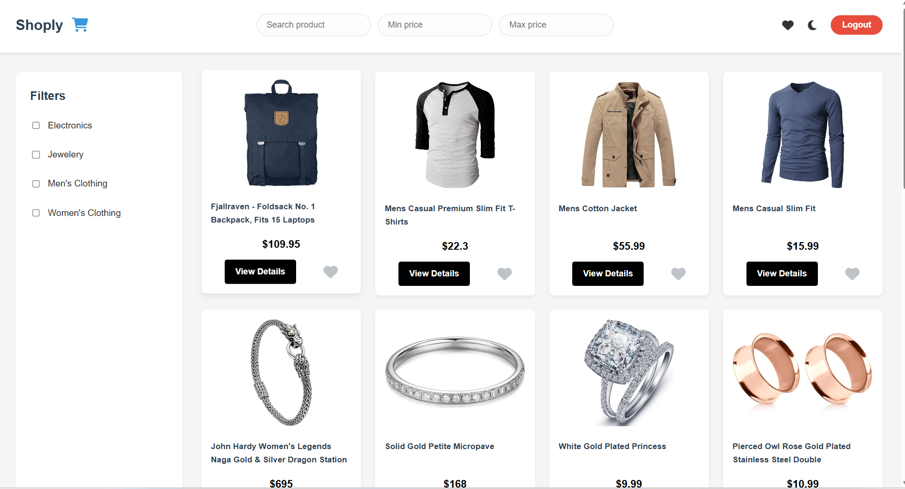

# Shoply - E-commerce Dashboard

Shoply is a modern, responsive e-commerce dashboard built with HTML, CSS, and JavaScript. It provides users with a clean interface to browse products, apply filters, and manage their shopping experience with features like product favoriting and dark mode.

## Cover Image

*Shoply Dashboard in action - showcasing a clean, professional e-commerce interface.*

## Hosted Link

Try out Shoply live at: [Shoply Dashboard](https://shoply-js.vercel.app/)

## Features

- **Product Browsing**: Displays products fetched from the Fake Store API with details view in a modal.
- **Search & Filtering**:
  - Search products by title
  - Filter by price range (min/max)
  - Category filtering via checkboxes
- **Favorites System**: 
  - Like/unlike products with persistent storage in localStorage
  - View only liked products with a single click
- **Dark Mode**: Toggle between light and dark themes
- **Responsive Design**: Adapts seamlessly to desktop, tablet, and mobile devices
- **Professional UI**: Clean, modern styling with hover effects and smooth transitions

## Tech Stack

- **HTML5**: Structure of the dashboard
- **CSS3**: Styling with responsive design and dark mode support
- **JavaScript**: Dynamic functionality and API integration
- **Font Awesome**: Icons for UI elements
- **Fake Store API**: Product data source

